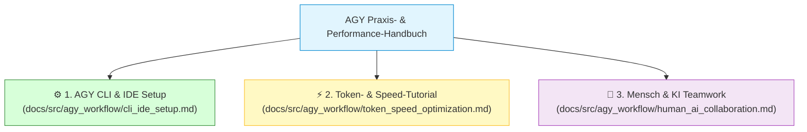

# 🚀 AGY CLI & AGY IDE: Praxis-Workflow, Einstellungen & Token-Optimierung

Herzlich willkommen im Praxis-Handbuch für die Arbeit mit **Google Antigravity (AGY)** im **MeinCMS Workspace**. Dieses Kapitel zeigt dir, wie du die **AGY CLI (`agy`)**, die **AGY IDE** und **Antigravity 2.0** optimal konfigurierst, deinen Entwicklungs-Workflow beschleunigst und den **Token-Verbrauch drastisch reduzierst**.

---

## 🧭 Übersicht & Unterkapitel

Um die Dokumentation übersichtlich zu halten, ist dieses Thema in drei vertiefende Praxis-Guides unterteilt:

### 📄 1. [Schritt-für-Schritt Setup & Konfiguration: AGY CLI & IDE](./agy_workflow/cli_ide_setup.md)
* **Inhalt:** Installation, `settings.json`, Terminal-Sandbox, Berechtigungen (Allowlists), die 3 Interaktionsmodi der IDE (Tab Autocomplete, Inline `Ctrl+I`, Sidebar Agent Mode) sowie Antigravity 2.0 Workspace-Rechte.

### ⚡ 2. [Tutorial: KI-Geschwindigkeit maximieren & Token-Verbrauch senken](./agy_workflow/token_speed_optimization.md)
* **Inhalt:** Vermeidung von Context Flooding, `.aiignore` & `.geminiignore` Konfiguration, gezieltes `@`-Mentioning, Subagenten-Isolation, Modellwahl (Flash vs. Pro) und konkrete Tricks für minimale Antwortzeiten und minimale Token-Kosten.

### 🤝 3. [Mensch & KI als Team: Augmented Engineering statt Weg-Rationalisierung](./agy_workflow/human_ai_collaboration.md)
* **Inhalt:** Warum das Ersetzen von Entwicklern durch reine KI zu Systemkollaps führt, die Symbiose aus Mensch (Architekt/Pilot) und KI (Co-Pilot), Human-in-the-Loop Prinzipien, Verantwortungskultur und Argumentationshilfen für Entwickler gegenüber dem Management.

---

## 🎯 Warum ist Workflow- & Token-Optimierung wichtig?

Ein unkonfigurierter KI-Agent kann schnell träge werden, wenn er bei jeder Frage das gesamte Repository scannen muss oder gigantische Log-Dateien in den Kontext lädt. 

| Problem bei fehlender Optimierung | Lösung durch das AGY Praxis-Handbuch |
| :--- | :--- |
| **Hohe Latenz (30+ Sekunden Warten)** | Gezielte Modellwahl (Flash/Lite) & fokussierte Prompting-Techniken (3-5 Sek. Latenz). |
| **Hoher Token-Verbrauch / hohe Kosten** | Kontext-Hygiene mit `.aiignore`, Subagenten-Isolation & exaktes `@`-Mentioning. |
| **Ungewollte Code-Änderungen** | Strikte Tool Execution Policies, Terminal Sandbox & Command Allowlists. |
| **Halluzinierte Code-Vorschläge** | Einbinden von [AGENTS.md](file:///home/thorsten/wissen-ahrensburg.de/.agents/AGENTS.md) und Domänen-Skills (`.agents/skills/`). |
| **Vorschnelles 'Weg-Rationalisieren'** | Etablieren des Augmented Engineering Paradigmas (Entwickler-Verstärkung statt Entlassung). |

---

> 🔗 **Direkt zu den Anleitungen:**
> - [👉 Weiter zu Kapitel 9.1: AGY CLI & IDE Setup & Konfiguration](./agy_workflow/cli_ide_setup.md)
> - [👉 Weiter zu Kapitel 9.2: Tutorial für maximale KI-Geschwindigkeit & Token-Sparsamkeit](./agy_workflow/token_speed_optimization.md)
> - [👉 Weiter zu Kapitel 9.3: Mensch & KI als Team (Augmented Engineering)](./agy_workflow/human_ai_collaboration.md)
