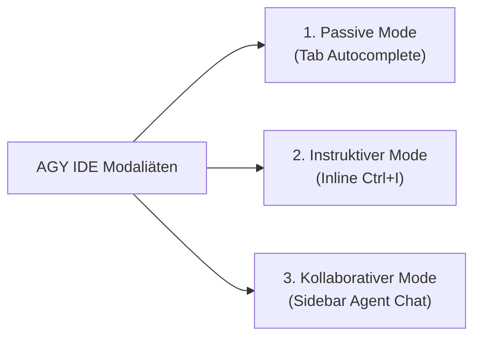

# ⚙️ Schritt-für-Schritt Setup & Konfiguration: AGY CLI & AGY IDE

Dieses Kapitel führt dich schrittweise durch die optimale Einrichtung von **Google Antigravity (AGY)** in der Konsole (**AGY CLI `agy`**), der **AGY IDE** (VS Code-basiert) und der **Antigravity 2.0 Desktop-App**.

---

## 1. AGY CLI (`agy`) – Terminal Setup & Einstellungen

Die **AGY CLI** ist das schnelle, leichtgewichtige Terminal-Interface für Entwickler.

### 🚀 Starten & Beenden
- **Starten:** Befehl `agy` im Projekt-Stammverzeichnis ausführen.
- **Beenden:** Tastenkombination `Ctrl+D Ctrl+D` drücken oder `/exit` eingeben.
- **Hilfe aufrufen:** `/help` im TUI-Chat eingeben oder `agy --help` im Terminal.

### ⚙️ Konfigurationsdatei `~/.gemini/antigravity-cli/settings.json`

Die Einstellungen für die CLI werden zentral in der Datei `~/.gemini/antigravity-cli/settings.json` verwaltet. Hier ist eine optimierte Praxis-Konfiguration für den MeinCMS Workspace:

```json
{
  "model": "gemini-3.5-flash",
  "terminalSandbox": true,
  "toolExecutionPolicy": "request-review",
  "permissionGrants": {
    "command": [
      "cargo check",
      "cargo test",
      "cargo clippy",
      "npm run build:docs"
    ],
    "read_file": [
      "/home/thorsten/wissen-ahrensburg.de"
    ]
  },
  "browserAllowlist": [
    "localhost",
    "127.0.0.1",
    "github.com",
    "docs.rs"
  ]
}
```

#### Erläuterung der wichtigsten Einstellungen:
* `model`: Standard-Modell für schnelle Antworten (`gemini-3.5-flash` für Tempo, `pro` für komplexe Refactorings).
* `terminalSandbox`: Ausführung aller Terminal-Befehle in einer isolierten Sandbox (Schutz vor ungewollten Systemänderungen).
* `toolExecutionPolicy`: `"request-review"` erfordert Entwickler-Bestätigung bei schreibenden/ausführenden Befehlen.
* `permissionGrants`: Erlaubt häufig genutzte Lese- und Test-Befehle ohne wiederholte Bestätigungsaufforderungen.

---

## 2. AGY IDE – Die 3 Interaktionsmodi im Überblick

Die **AGY IDE** integriert Agenten-Workflows direkt in den Editor. Je nach Aufgabe wählst du den passenden Interaktionsmodus:



### A. Passiver Modus: Tab Autocomplete & Supercomplete
Ideal für schnelles Tippen, automatische Importe und Navigation.
* **Autocomplete:** Schlägt Code direkt an der Cursor-Position vor.
* **Supercomplete:** Schlägt größere Diffs (inkl. Löschungen und Refactorings) in schwebenden Fenstern vor.
* **Tab-to-Jump:** Antizipiert die nächste Navigationsstelle im Code – drücke `<tab>`, um dorthin zu springen.
* **Tab-to-Import:** Fügt fehlende `use`-Statements in Rust oder `require/import` in JS automatisch am Dateianfang ein.
* **Steuerung:**
  * `<tab>`: Vorschlag akzeptieren.
  * `<esc>`: Vorschlag verwerfen.
  * `Ctrl` + `->` (Linux/Windows) / `Cmd` + `->` (macOS): Vorschlag wortweise akzeptieren.

### B. Instruktiver Modus: Inline Command (`Ctrl+I` / `Cmd+I`)
Ideal für punktuelle Änderungen an bestehendem Code, ohne den Kontext des Haupt-Chats zu belasten!
1. Markiere einen Codeblock im Editor.
2. Drücke `Ctrl+I` (bzw. `Cmd+I`).
3. Gib eine gezielte Anweisung ein (z. B. *"Füge Dokumentationskommentare hinzu"* oder *"Refaktoriere dieses match-Statement"*).
4. **Vorteil:** Verbraucht extrem wenige Token, da nur der markierte Block verarbeitet wird.

### C. Kollaborativer Modus: Sidebar Chat & Agent Mode
Ideal für komplexe, mehrstufige Aufgaben, Feature-Entwicklung und Architekturfragen.
* **Sidebar Chat:** Diskussion, Planung und Fragen zum Codebase.
* **Agent Mode:** Autonomer Pair-Programmer, der Dateien liest/schreibt, Terminal-Befehle ausführt und Tests validiert.
* **Inline Code Lenses:** Buttons über Funktionen/Structs (z. B. *"Refactor"*, *"Write Tests"*), um Agenten-Aktionen direkt an Symbolen auszulösen.
* **Diagnostic Auto-Fix:** Klicke bei Compiler-Warnungen oder Clippy-Fehlern auf *"Auto-Fix with Agent"*.

---

## 3. Antigravity 2.0 & Rechteverwaltung (Permissions)

In **Antigravity 2.0** kannst du globale und projektbezogene Sicherheitseinstellungen konfigurieren:

### 🛡️ Tool Execution Policies
* **`always-proceed`:** Befehle werden automatisch ohne Rückfrage ausgeführt (nur in sicheren Test-Umgebungen empfohlen).
* **`request-review`:** Der Entwickler muss jeden Terminal-Befehl vor Ausführung manuell freigeben (Standard & Empfohlen).
* **`proceed-in-sandbox`:** Befehle laufen automatisch in einer isolierten Linux-Unshare/Docker-Sandbox.
* **`strict`:** Schreibende Operationen sind deaktiviert.

### 📁 Datei- & Netzwerk-Zugriffsregeln
* **Non-Workspace File Access:** Blockiert den Zugriff auf Dateien außerhalb von `/home/thorsten/wissen-ahrensburg.de` (`deny`).
* **Internet Access Policy:** Beschränkt Web-Suchen und URL-Retrieval (`read_url_content`) auf freigegebene Doku-Domains.
* **Command Denylist:** Befehle wie `rm -rf /` oder `git push --force` sind strikt verboten.

---

> ➡️ **Nächster Schritt:** [Weiter zum Token- & Speed-Optimierungs-Tutorial (Kapitel 9.2)](./token_speed_optimization.md)
