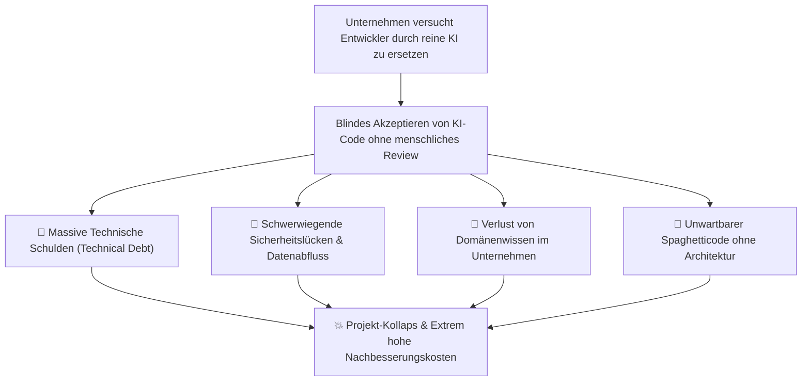
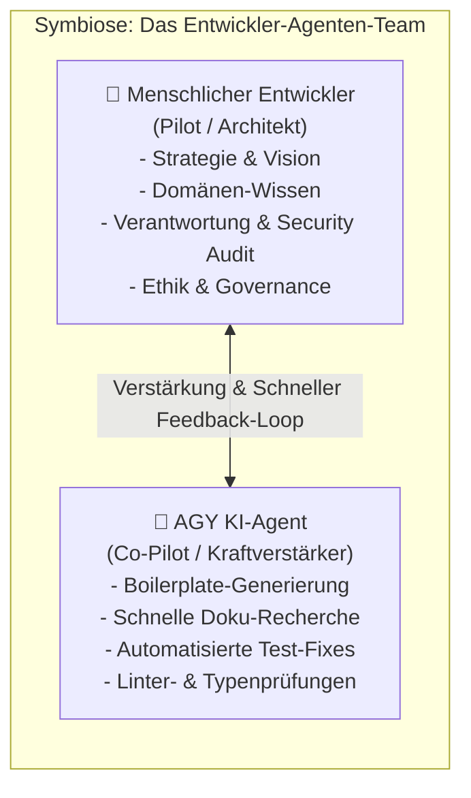

# 🤝 Mensch & KI-Agenten als Team: Augmented Engineering statt Weg-Rationalisierung

Dieses Kapitel behandelt den **Kultur- und Paradigmenwechsel** bei der Arbeit mit KI-Agenten wie **Google Antigravity (AGY CLI & AGY IDE)**. Es zeigt auf, warum der Versuch von Unternehmen, Entwickler durch KI zu "weg-zurationalisieren", scheitern muss und wie eine echte **Symbiose aus Mensch und KI (Augmented Engineering)** zu nachhaltigem Erfolg führt.

---

## 🛑 1. Das Industrie-Missverständnis: "Weg-Rationalisierung" von Entwicklern

In vielen Unternehmen und Chefetagen herrscht die irrige Annahme, KI-Agenten dienten primär dazu, **Entwickler-Personal einzusparen oder komplett zu ersetzen**. Diese Denkweise führt in der Praxis zu verheerenden Konsequenzen:

### Die Risiken rein automatisierter Code-Generierung ohne Mensch:
1. **Kein tiefes Architekturverständnis:** Eine KI hat kein Bewusstsein für langfristige Produktstrategien, Domänenlogik oder Business-Zusammenhänge.
2. **Qualitäts- und Sicherheitsverlust:** Ohne menschliches Security-Review schleichen sich XSS-Lücken, Multi-Tenancy-Datenlecks oder Heap-Speicherfehler ein.
3. **Verlust von Know-how:** Wenn niemanden mehr den Code liest und versteht, ist bei Systemausfällen kein Entwickler mehr in der Lage, Notfall-Debugging zu betreiben.

---

## 🧠 2. Das richtige Paradigma: Symbiose & Augmented Engineering

Die Zukunft erfolgreicher Softwareentwicklung liegt nicht in der Ersetzung des Menschen, sondern in der **Verstärkung des Entwicklers (Augmented Engineering)**:

### Rollenverteilung im Entwickler-Team:

| Bereich | 👤 Menschlicher Entwickler (Der Pilot) | 🤖 AGY KI-Agent (Der Co-Pilot) |
| :--- | :--- | :--- |
| **Verantwortung** | **100% Letztverantwortung** für Funktion, Sicherheit & Recht. | Keine Haftung, rein assistierendes Werkzeug. |
| **Architektur** | Plant Module, Datenmodelle & Systemgrenzen. | Setzt vorgeschlagene Schemata in Code um. |
| **Code Review** | Liest den Diff Zeile für Zeile und hinterfragt Entscheide. | Schlägt Optimierungen & Refactorings vor. |
| **Routineaufgabe** | Konzentriert sich auf komplexe Problemstellungen. | Übernimmt repetitive Schreibarbeit & Boilerplate. |
| **Wissen & Lernen** | Erweitert eigenes Verständnis durch Rückfragen an die KI. | Erklärt Codeabschnitte & Dokumentation. |

---

## 🛠️ 3. Praxis-Guidelines für Entwickler-Teams im AGY Workspace

Um eine gesunde, hochproduktive Teamkultur mit KI-Agenten im Unternehmen zu etablieren, gelten folgende Grundsätze:

### 1. Human-in-the-Loop (HITL) als unverrückbarer Standard
* Kein KI-generierter Code wird ohne explizites menschliches Code-Review gemergt.
* Die AGY IDE Tool Execution Policy bleibt stets auf `request-review` oder `proceed-in-sandbox`.

### 2. Die KI als Junior-Entwickler betrachten
* Behandle den AGY Agenten wie einen extrem schnellen, aber unerfahrenen Junior-Entwickler.
* Prüfe seine Vorschläge kritisch, korrigiere Denkfehler und verlange Erklärungen, wenn Logik unklar erscheint.

### 3. Wissenstransfer fördern statt Hirn ausschalten
* Nutze die KI, um neues Wissen im Team aufzubauen.
* **Beispiel-Prompt:** *"Erkläre unserem Team in 3 Sätzen, warum du hier `tokio::select!` statt `join!` verwendet hast."*

### 4. Qualitätsstandards durch unbestechliche Gates sichern
* Der Mensch definiert die Qualitätsregeln in [AGENTS.md](file:///home/thorsten/wissen-ahrensburg.de/.agents/AGENTS.md) und den [Skills](file:///home/thorsten/wissen-ahrensburg.de/docs/src/skills/README.md).
* Die KI muss die automatischen Qualitätsgates (`cargo check`, `cargo test`, `cargo clippy`, `npm run build:docs`) fehlerfrei bestehen.

---

## 💬 4. Argumentations-Leitfaden gegenüber Führungskräften & Management

Wenn Unternehmensleiter oder Entscheider KI als reines "Personaleinsparungs-Tool" missverstehen, nutze folgende Argumente:

1. **"KI ist kein Entwickler-Ersatz, sondern ein Entwickler-Verstärker."**
   * *Argument:* Mit AGY CLI & IDE schaffen Entwickler in der gleichen Zeit die 3- bis 5-fache Menge an qualitativ hochwertigen Features – ohne Qualitätsverlust.

2. **"Blindes Sparen führt zu gigantischer Technical Debt."**
   * *Argument:* Unbewachter KI-Code erzeugt versteckte Fehler, die später um ein Vielfaches teurer zu reparieren sind als die Ersparnis durch Personalabbau.

3. **"Sicherheit & Compliance erfordern den Menschen."**
   * *Argument:* KI haftet nicht für Datenschutzverstöße (DSGVO), Sicherheitslücken oder Urheberrechtsverletzungen. Nur erfahrene Entwickler garantieren Governance und Sicherheit.

4. **"Höhere Entwickler-Zufriedenheit & Innovation."**
   * *Argument:* KI nimmt Entwicklern lästige Routineaufgaben ab. Das steigert die Arbeitsfreude und lässt Raum für echte Innovation und bessere Produkte.

---

> 🔗 **Verwandte Themen:**
> - [👉 Kapitel 8: KI-Agenten, Subagenten & Praxis-Handbuch Vibe Coding](../ai_agent_security_vibe_coding.md)
> - [👉 Kapitel 9.1: AGY CLI & IDE Setup & Konfiguration](./cli_ide_setup.md)
> - [👉 Kapitel 9.2: Tutorial für KI-Geschwindigkeit & Token-Sparsamkeit](./token_speed_optimization.md)
