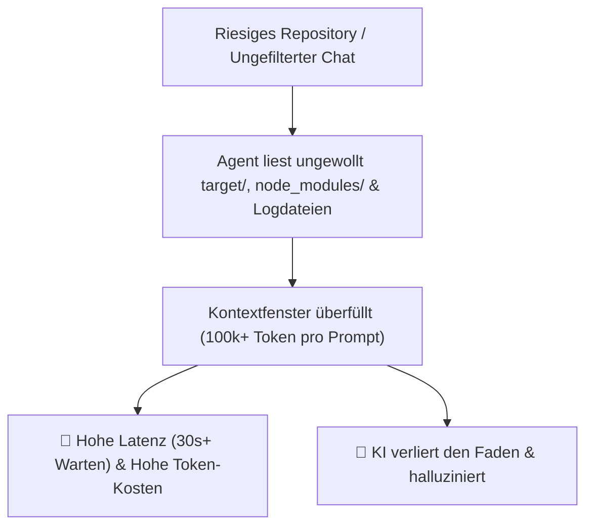
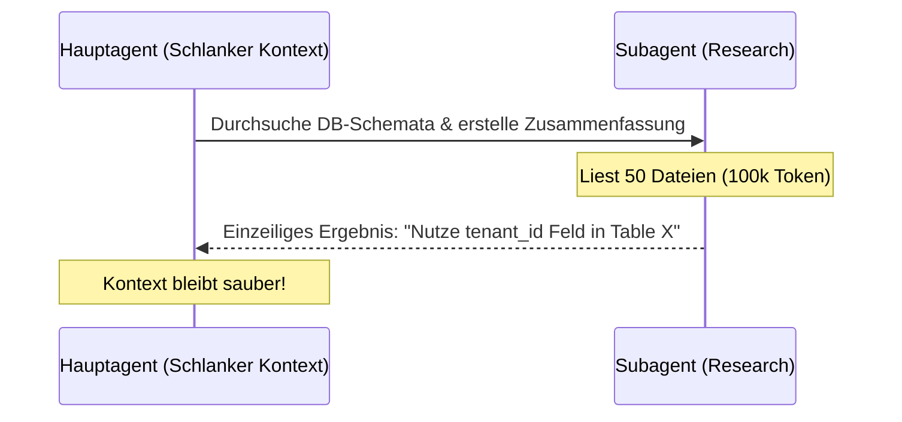

# ⚡ Tutorial: KI-Geschwindigkeit maximieren & Token-Verbrauch drastisch senken

Dieses Tutorial zeigt dir Schritt für Schritt, wie du **Google Antigravity (AGY)** extrem schnell machen kannst (**Antwortzeiten von 3–5 Sekunden**) und gleichzeitig den **Token-Verbrauch um bis zu 85% reduzierst**.

---

## 🛑 1. Das Problem: Warum wird die KI langsam und teuer?

Wenn KI-Agenten in großen Repositories arbeiten, tritt häufig **Context Flooding (Kontext-Überflutung)** auf:



**Hauptursachen für hohen Token-Verbrauch:**
1. **Ungefiltertes Dateilisten:** Die KI durchsucht kompilierte Ordner (`target/`, `node_modules/`, `docs/book/`).
2. **Riesige Terminal-Outputs:** Kompilier-Logs mit 50.000 Zeilen werden ungeschnitten in den Chat gepostet.
3. **Schwammige Prompts:** *"Überprüfe das Projekt"* zwingt die KI, das ganze Repository einzulesen.
4. **Falsche Modellwahl:** Nutzung von Großmodellen (`Pro`) für triviale Syntax-Prüfungen.

---

## 🛠️ 2. Schritt-für-Schritt Anleitung zur Performance-Optimierung

Mit den folgenden 6 Schritten optimierst du die Geschwindigkeit und Effizienz deines Entwicklungs-Workflows:

### Schritt 1: Das Ausschlussdateien-Triplett konfigurieren (`.aiignore`, `.geminiignore`, `.gitignore`)

Erstelle oder aktualisiere die `.aiignore` und `.geminiignore` Dateien im Projektstammverzeichnis, um schwere Build-Artefakte und temporäre Ordner vom Agenten-Kontext auszuschließen:

```gitignore
# .aiignore & .geminiignore für MeinCMS
target/
node_modules/
docs/book/
.git/
*.log
*.tmp
.env
```

* **Effekt:** Die KI ignoriert Binärdateien und Abhängigkeiten komplett. **Token-Ersparnis: ~60%**.

---

### Schritt 2: Gezieltes `@`-Mentioning statt allgemeiner Fragen

Nutze in der AGY IDE oder Antigravity 2.0 das `@`-Symbol, um exakt die benötigten Dateien an die Nachricht anzuhängen:

* ❌ **Schlecht:** *"Wo werden die Artikel-Routen verarbeitet?"* (Agent durchsucht den gesamten Ordner).
* ✅ **Gut:** *"Analysiere `@file:meincms_web/src/routes/wiki.rs` und erkläre mir die Handler-Funktion."*

* **Effekt:** Der Agent liest nur diese eine Datei ein. **Token-Ersparnis: ~80%**.

---

### Schritt 3: Subagenten zur Kontext-Isolation einsetzen (`invoke_subagent`)

Nutze Subagenten für lange Recherche- oder Diagnoseaufgaben. Ein Subagent arbeitet in einer separaten Konversation und liefert nur das Ergebnis zurück:



* **Praxis-Tipp:** Delegiere mit `/invoke_subagent` oder nutze den `research` Subagenten für Code-Analysen.

---

### Schritt 4: Das richtige Modell für die Aufgabe wählen

Wechsle das Modell in den Einstellungen (`settings.json` oder Dropdown in Antigravity 2.0):

| Modus / Aufgabe | Empfohlenes Modell | Geschwindigkeit | Token-Effizienz |
| :--- | :--- | :--- | :--- |
| **Inline Edit (`Ctrl+I`), Tab Autocomplete, Linter Fixes** | `Gemini 3.5 Flash` / `Flash-Lite` | ⚡ Blitzschnell (1-3s) | 🟢 Extrem sparsam |
| **Normaler Chat, Feature-Entwicklung, Code Reviews** | `Gemini 3.5 Flash` (Medium) | 🚀 Sehr schnell (3-5s) | 🟢 Sehr sparsam |
| **Komplexe Architektur-Refactorings, Miri-Debugging** | `Gemini Pro` | 🐢 Langsam (10-25s) | 🟡 Hohe Token-Tiefe |

---

### Schritt 5: Terminal-Output im Prompt begrenzen

Achte darauf, dass Terminal-Ausgaben nicht den Kontext überfluten:

* ❌ **Schlecht:** `cat debug.log` (Gibt 10.000 Zeilen im Terminal aus).
* ✅ **Gut:** `cargo check -p meincms_web` oder `git log -n 5`.

---

### Schritt 6: Slash Commands nutzen (`/plan`, `/goal`, `/schedule`)

Verwende integrierte Slash-Commands für strukturierte Arbeitsabläufe:
* `/plan`: Stoppt die KI vor der Code-Generierung und zwingt sie, zuerst einen knappen Schritt-für-Schritt-Plan zu erstellen.
* `/goal`: Für autonome, tiefe Tasks über Nacht oder längere Zeiträume.
* `/schedule`: Erstellt getimerte Hintergrundeinheiten, ohne die Entwickler-Session zu blockieren.

---

## 📊 3. Vorher-/Nachher-Vergleich

| Metrik | Ungematchter Workflow | Optimierter AGY Workflow |
| :--- | :--- | :--- |
| **Durchschnittliche Antwortzeit** | 25 – 45 Sekunden | **2 – 5 Sekunden** |
| **Token-Verbrauch pro Prompt** | 80.000 – 150.000 Token | **4.000 – 12.000 Token** |
| **Präzision der Antworten** | Mittel (Halluzinationsgefahr) | **Sehr hoch (Fokussiert)** |
| **Entwickler-Wartezeit pro Tag** | ~45 Minuten | **~5 Minuten** |

---

## 📋 4. Entwickler-Schnell-Checkliste für maximales Tempo

Vergewissere dich vor jedem großen Task:
- [ ] Ist `.aiignore` vorhanden und schließt `target/` sowie `node_modules/` aus?
- [ ] Habe ich konkrete Dateien per `@file:` referenziert?
- [ ] Nutze ich `Gemini Flash` für Standard-Aufgaben?
- [ ] Ist für punktuelle Änderungen Inline `Ctrl+I` statt des Haupt-Chats gewählt?
- [ ] Habe ich bei großen Recherchen einen Subagenten eingesetzt?
