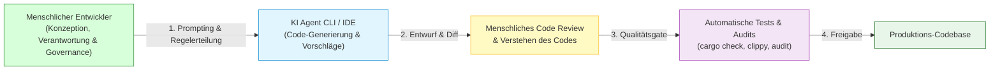
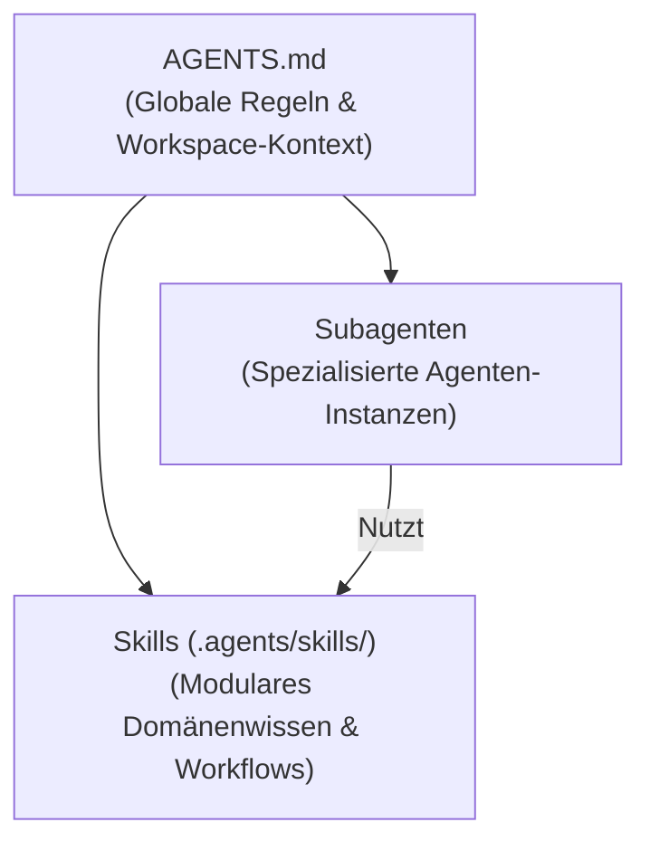
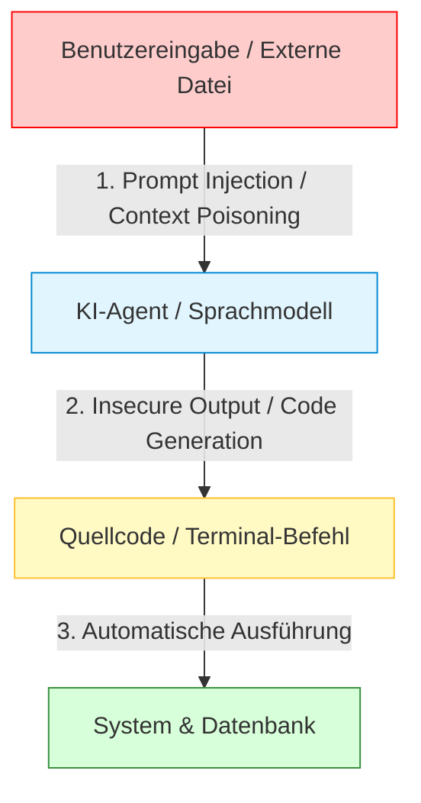
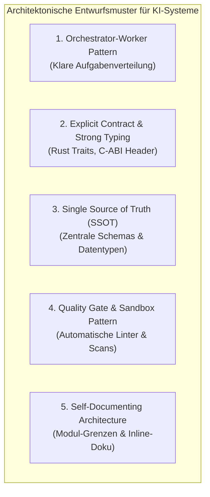
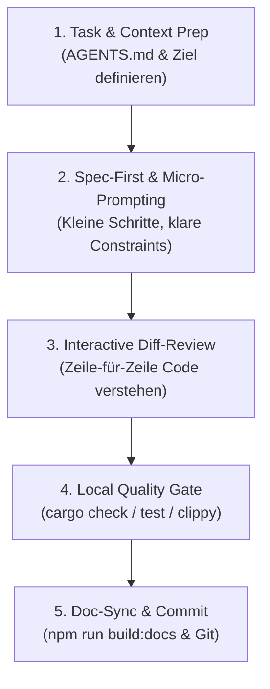

# 🤖 KI-Agenten, Subagenten, Prompt-Sicherheit & Praxis-Handbuch Vibe Coding

Dieses Kapitel beschreibt die Sicherheitsstrategie für **KI-gestützte Entwicklung (Vibe Coding)**, die **menschliche Letztverantwortung bei der Nutzung von KI Agent CLIs und IDEs**, die Tiefenarchitektur von **AGENTS.md, Subagenten und Skills**, maßgebliche **Design Patterns & Softwarearchitekturen** sowie ein **konkretes Praxis-Handbuch** für den täglichen Entwicklungsalltag im MeinCMS Workspace.

---

## 1. Menschliche Verantwortung vs. KI-Agent (CLI & IDE)

### 👤 Der Mensch ist verantwortlich – nicht die Maschine!
Ob beim Einsatz von **KI Agent CLIs** (wie Google Antigravity, Claude Code, Aider) oder **KI Agent IDEs** (wie Cursor, Windsurf, VS Code KI-Plugins):
* **Die KI ist ein Werkzeug (Assistent), kein Entwickler mit Haftung oder Urteilsfähigkeit.**
* Die **rechtliche, funktionale und sicherheitsbezogene Letztverantwortung** liegt ausnahmslos beim **menschlichen Entwickler**!
* Die Maschine halluziniert, übersieht Edge Cases oder wählt veraltete Muster, wenn sie nicht strikt geleitet und überprüft wird.



### 🧠 Verstehen, was programmiert wird – Das Vibe-Coding-Dilemma
Ein zentraler Grundsatz der Softwareentwicklung mit KI lautet:
> ⚠️ **Wer Code nicht versteht, kann ihn später weder warten, verbessern, refaktorieren noch von Sicherheitslücken befreien!**

Blindes **"Vibe Coding"** (einfaches Akzeptieren von KI-Vorschlägen ohne Durchlesen und Verstehen):
1. **Erzeugt technische Schulden (Technical Debt):** Es entsteht unübersichtlicher "Spaghetticode", der unnötig komplex ist.
2. **Erschwert spätere Anpassungen:** Wenn ein Bug auftritt oder eine Funktion erweitert werden muss, versteht niemand mehr, warum die KI bestimmte Variablen oder Pfade gewählt hat.
3. **Führt zu verdeckten Sicherheitslücken:** Unsichere C-ABI Speicherzugriffe, fehlendes HTML-Escaping oder falsche Datenbankschlüssel bleiben unbemerkt.

**Verpflichtende Entwickler-Regel:**
* Vor dem Committen muss der Entwickler den von der KI generierten Code **Zeile für Zeile durchlesen**.
* Bei unklaren Abschnitten ist die KI aufzufordern: *"Erkläre mir schrittweise, was dieser Codeblock tut und warum dieses Muster gewählt wurde."*

---

## 2. Architektur der KI-Steuerung: AGENTS.md, Subagenten & Skills

Um sicherzustellen, dass unterschiedliche KI-Agenten konsistenten, sicheren und architekturkonformen Code schreiben, nutzt das Projekt ein dreistufiges Steuerungssystem:



### 📄 1. `AGENTS.md` (Das zentrale Regelwerk)
`AGENTS.md` ist die Ankerdatei für jeden KI-Agenten im Workspace. Sie wird bei jedem Agentenstart automatisch in den Systemkontext geladen.
* **Inhalt:** Technologie-Stack (Rust, Axum, Maud, PostgreSQL), Sicherheitsregeln (XSS-Schutz, Unix Sockets, `.env`-Sperren), Befehle für Qualitätssicherung (`cargo check`, `npm run build:docs`).
* **Zweck:** Stellt sicher, dass kein Agent projektfremde Frameworks (wie TailwindCSS ohne Absprache) oder unsichere Praktiken einführt.

### 🤖 2. Subagenten (Isolierte Spezialisierungen)
Ein **Subagent** ist eine eigenständige KI-Instanz, die für eine spezifische Teilaufgabe (z. B. Recherche, Datenbankabfragen, UI-Building) aufgerufen wird.
* **Vorteile:**
  * **Context Isolation:** Der Hauptagent bleibt übersichtlich und wird nicht mit tausenden Zeilen Analyse-Log überflutet.
  * **Least Privilege:** Ein Research-Subagent erhält nur Lese-Rechte (`view_file`, `grep_search`), während ein Worker-Subagent Schreibrechte besitzt.
  * **Fokussierte Systemprompts:** Ein `db_admin`-Subagent kennt primär SQLx- und PostgreSQL-Konventionen.

### 🛠️ 3. Skills (`.agents/skills/`)
**Skills** sind modulare Ordner mit detaillierten Handbüchern (`SKILL.md`), Hilfsskripten und Referenzbeispielen.
* **Ordnerstruktur:**
  ```text
  .agents/skills/
  ├── admin_manager/   # User-Management CLI Expertenwissen
  ├── backup_manager/  # YAML/XML Ex-/Import & Repair Expertenwissen
  ├── db_admin/        # SQLx & PostgreSQL Expertenwissen
  ├── meincms_worker/  # Rust Workspace & Webserver Entwickler
  ├── parser/          # meincms_parser C-FFI & Markdown Compiler
  └── ui_worker/       # Maud Templating, Vanilla JS & CSS
  ```
* **Aufbau einer `SKILL.md`:** Enthält YAML-Frontmatter (`name`, `description`) sowie Schritt-für-Schritt-Anleitungen für komplexe Operationen.

---

## 3. LLM- & Kontext-Sicherheitslücken (OWASP Top 10 for LLMs)

Beim Einsatz von Sprachmodellen und autonomen Agenten müssen folgende Hauptschwachstellen abgewehrt werden:



### 1. Prompt Injection (Direkt & Indirekt)
* **Direkt:** Ein Angreifer versucht über die Benutzeroberfläche oder Formularingaben den KI-Systemprompt zu überschreiben.
* **Indirekt:** Bösartiger Text befindet sich in verarbeiteten Wiki-Artikeln, Markdown-Dateien oder extern abgerufenen Webseiten (`read_url_content`), um den KI-Agenten während der Analyse zu manipulieren.
* **Abwehr:** Strikte Trennung von Systeminstruktionen und Daten-Kontext. Keine Ausführung von Anweisungen aus unvertrauten Inhalten ohne Validierung.

### 2. Context Poisoning (Kontext-Vergiftung)
* Manipulierte Quelldateien oder Repositories injizieren gefälschte Regeln oder schädlichen Code in den Arbeitskontext des Agenten.
* **Abwehr:** Immutable Konfigurationsdateien (`AGENTS.md`, `.env.example`) und schreibgeschützte Validierungsregeln.

### 3. Sensitive Data Exposure (Datenabfluss im Prompt)
* Auslesen von Passwörtern, `.env`-Dateien oder API-Keys in den Modell-Kontext.
* **Abwehr:** `.env` und vertrauliche Dateien sind in `.gitignore` eingetragen. Webserver blockiert den Zugriff auf Konfigurationspfade mit HTTP 403.

---

## 4. Design Patterns & Softwarearchitektur für Multi-Agenten-Systeme

Wenn mehrere KI-Agenten oder unterschiedliche Entwickler an einem Projekt arbeiten, muss die Softwarearchitektur **kristallklar, streng typisiert und deterministisch** sein.



### 🧱 Pattern 1: Orchestrator-Worker Pattern (Hierarchische Delegation)
* **Problem:** Ein einzelner Agent verliert bei großen Tasks den Überblick oder überschreitet Kontextgrenzen.
* **Lösung:** Der Hauptagent fungiert als Orchestrator (Plant Schritte, verteilt Aufgaben). Subagenten führen klar begrenzte Einzelaufgaben aus und liefern strukturierte Ergebnisse zurück.

### 📜 Pattern 2: Explicit Contract & Strong Typing Pattern
* **Problem:** KI-Agenten neigen in dynamischen Sprachen (wie JavaScript oder Python) zu Annahmen über Objektstrukturen ("Magic Objects"), was zu Laufzeitfehlern führt.
* **Lösung in Rust:** Nutzung von Rusts striktem Typensystem (`struct`, `enum`, `Option<T>`, `Result<T, E>`). Typfehler werden direkt vom Compiler abgefangen (`cargo check`), sodass halluzinierter Code gar nicht erst kompilierbar ist. Bei C-FFI Schnittstellen gibt ein C-Header (`meincms_parser.h`) exakte Verträge vor.

### 📌 Pattern 3: Single Source of Truth (SSOT)
* **Problem:** KI-Agenten erstellen doppelte Typdefinitionen oder widersprüchliche Konfigurationslogiken an verschiedenen Orten.
* **Lösung:** Zentrale Datenmodelle in vertrauenswürdigen Quelldateien (z. B. `WikiArtikel` in SQLx/Rust). Konfigurationen ausschließlich in `.env.example`.

### 🛡️ Pattern 4: Quality Gate & Defensive Sandbox Pattern
* **Problem:** KI-generierter Code könnte unbemerkt Sicherheitslücken (wie `unsafe`-Missbrauch in Rust oder Pufferüberläufe in C) einschleusen.
* **Lösung:** Jede Codeänderung muss ein unbestechliches Testgate durchlaufen. CLI-Agenten führen automatisch Linter (`cargo clippy`), Sicherheitsscans (`cargo audit`, `flawfinder`) und Formatter (`cargo fmt`) aus.

### 📖 Pattern 5: Self-Documenting & Explainable Architecture
* **Problem:** Zukünftige KI-Agenten verstehen verschachtelte Logik ohne Dokumentation nicht korrekt und generieren fehlerhafte Refactorings.
* **Lösung:** Jedes Modul besitzt klare Dokumentationskommentare (`///` in Rust) und Architekturbeschreibungen in `docs/src`.

---

## 5. Vibe Coding Absichern in den Kernsprachen (C, C++, Rust, JavaScript)

KI-generierter Code wird vor der Übernahme in das Repository sprachspezifischen Sicherheitsprüfungen unterzogen:

### 🔴 C & C++ (Speicher- & C-ABI-Sicherheitsbewertung)

Beim Generieren von C-Code oder C-ABI Exporten (`meincms_parser.h`):

| Risiko bei KI-Code | Guardrail / Scanner-Befehl | Abwehrmaßnahme |
| :--- | :--- | :--- |
| Pufferüberläufe (`strcpy`, `sprintf`) | `flawfinder .` | Ersetzen durch sichere Varianten (`strncpy`, `snprintf`) |
| Speicherlecks & Nullpointer | `cppcheck --enable=all .` | Automatische statische Fehleranalyse |
| C-FFI Heap-Speicherlecks | `valgrind --leak-check=full ./app` | Pflichtaufruf von `meincms_free_string(ptr)` nach Nutzung |
| Laufzeit-Speicherfehler | GCC Flag `-fsanitize=address` | Kompilieren mit AddressSanitizer (ASan) |

### 🦀 Rust (Typensicherheit & Unsafe-Analyse)

Rust bietet durch den Ownership-Borrow-Checker von Haus aus höchste Speichersicherheit. Bei KI-Code muss insbesondere die Verwendung von `unsafe` überwacht werden:

| Risiko bei KI-Code | Guardrail / Scanner-Befehl | Abwehrmaßnahme |
| :--- | :--- | :--- |
| Halluzinierte `unsafe`-Blöcke | `cargo geiger` | Misst den Sicherheitswert und verweigert unnötige `unsafe`-Blöcke |
| Undefined Behavior in `unsafe` | `cargo miri test` | Erkennt Speichermodell-Verletzungen zur Compile-/Testzeit |
| Skript-Endlosschleifen (DoS) | Rhai Sandbox Limit | Eingebettete Rhai-Makros sind auf max. Operationstiefe beschränkt |
| Veraltete Crates | `cargo audit` & `cargo deny` | Abgleich mit RustSec Datenbank & Lizenzprüfung |

### 💛 JavaScript & Node.js (Web- & Dependency-Sicherheit)

Bei KI-generiertem Frontend-Code oder Node.js-Skripten:

| Risiko bei KI-Code | Guardrail / Scanner-Befehl | Abwehrmaßnahme |
| :--- | :--- | :--- |
| Cross-Site Scripting (XSS) | Maud Templating & `html-escape` | Automatisches HTML-Escaping, Verbot von `innerHTML` |
| Unsichere JS-APIs (`eval`) | `npx eslint --plugin security .` | Statische Code-Analyse mit `eslint-plugin-security` |
| Verwundbare JS-Bibliotheken | `retire --path .` | Scannt JS-Dateien auf bekannte Sicherheitslücken |
| Supply-Chain-Risiken | [Socket.dev](https://socket.dev) & `snyk test` | Prüft NPM-Pakete auf bösartige Skripte & Telemetrie |

---

## 6. Automatisiertes Test- & Review-Gate für KI-Code

Jeder durch KI-Agenten generierte oder modifizierte Code muss folgendes Prüfgate durchlaufen:

```bash
# 1. Rust Workspace & Typenprüfung
cargo check
cargo test --workspace

# 2. Linter & Formatierung
cargo clippy
cargo fmt --check

# 3. Sicherheits- & Abhängigkeits-Audits
cargo audit
npm audit
osv-scanner -r .

# 4. Dokumentation bauen & mdBook aktualisieren
npm run build:docs
```

---

## 7. 📘 Praxis-Handbuch: Vibe Coding im Entwickler-Alltag

Vibe Coding bedeutet nicht, die Kontrolle abzugeben, sondern **menschliche Intuition, Produktstrategie und Qualitätskontrolle mit der rasenden Geschwindigkeit generativer KI zu verschmelzen**.

### 7.1 Der 5-Stufen-Workflow für sicheres Vibe Coding



#### Stufe 1: Kontext & Vorbereitung (Context Prep)
* **Ziel:** Die KI mit den notwendigen Informationen versorgen, ohne ihren Kontextfenster mit unnötigem Code zu überladen.
* **Praxis-Aktion:** Verweise explizit auf bestehende Moduldateien oder nutze Subagenten-Skills (z. B. `.agents/skills/ui_worker/SKILL.md`), statt der KI freie Hand zu lassen.
* **Beispiel:** *"Lies `meincms_web/src/routes/wiki.rs` bevor du eine neue Route hinzufügst."*

#### Stufe 2: Spec-First & Micro-Iteratives Prompting
* **Ziel:** Halluzinationen und gigantische, unüberschaubare Diffs vermeiden.
* **Praxis-Aktion:** Zerlege komplexe Features in atomare Schritte (Interface/Struct -> Datenbankschicht -> Web-Handler -> Maud UI -> Frontend JS).
* **Regel:** Lass die KI erst Datenstrukturen (`struct`, `enum`) oder Methodensignaturen vorschlagen und bestätige diese, bevor der Rumpf implementiert wird.

#### Stufe 3: Interaktives Code-Review (Pair-Programming-Modus)
* **Ziel:** Vollständiges Verständnis des geschriebenen Codes sichern.
* **Praxis-Aktion:** Akzeptiere NIEMALS blind Code, den du nicht verstehst. Nutze Rückfragen an die KI:
  * *"Warum verwendest du hier `tokio::spawn` statt eines direkten Async-Calls?"*
  * *"Welche Edge Cases entstehen, wenn `tenant_id` leer ist?"*
  * *"Stelle sicher, dass kein `unsafe`-Block ohne explizite Begründung eingefügt wird."*

#### Stufe 4: Lokales Quality Gate & Verifikation
* **Ziel:** Sofortige Rückmeldung über Syntax-, Typ- oder Linter-Fehler.
* **Praxis-Aktion:** Lass das automatische Qualitätssicherungs-Gate im Terminal ausführen:
  * `cargo check` (Prüft Rust-Typen & Kompilierbarkeit)
  * `cargo test --workspace` (Führt alle Unit- & Integrationstests aus)
  * `cargo clippy` (Prüft Idiomatik & Performancelücken)

#### Stufe 5: Dokumentation & Commit
* **Ziel:** Nachhaltigkeit des Quellcodes und Synchronität des Handbuchs.
* **Praxis-Aktion:** Führe `npm run build:docs` aus, um die mdBook-Dokumentation zu aktualisieren, und erstelle einen aussagekräftigen Git-Commit.

---

## 8. 💻 Konkrete Praxisbeispiele im MeinCMS Workspace

Im Folgenden werden vier praxisnahe Szenarien aus dem MeinCMS Entwicklungsalltag Schritt für Schritt demonstriert.

### 8.1 Praxisbeispiel A: Neue Web-Funktion im Axum/Maud-Stack

**Aufgabenstellung:** Hinzufügen einer Revisions-Vergleichsansicht (Diff-View) in `meincms_web`.

#### 1. Praxis-Prompt an den KI-Agenten:
```text
Wir möchten in 'meincms_web' eine neue Route 'GET /wiki/:title/diff' hinzufügen.
- Nutze Axum 0.7 und Maud Templating.
- Filtere strikt nach TenantId über den Hostname-Extractor (Multi-Tenancy).
- Die HTML-Ausgabe muss den XSS-Regeln entsprechen (Maud escapt Variablen automatisch, nutze kein PreEscaped für User-Inhalte).
- Erstelle dazu das Maud-Template in 'meincms_web/src/views/diff.rs' und binde es in 'routes.rs' ein.
- Gib mir zuerst die Signatur des Handlers und das Datenmodell für den Revisions-Vergleich zur Freigabe.
```

#### 2. Interaktives Code-Review des Entwicklers:
Der Entwickler prüft den von der KI generierten Handler-Code:
```rust
// MEINCMS SAFETY REVIEW: TenantId muss zwingend in der SQL-Query vorkommen!
pub async fn wiki_diff_handler(
    Host(host): Host,
    State(pool): State<PgPool>,
    Path(title): Path<String>,
) -> Result<Markup, WebError> {
    let tenant_id = extract_tenant_id(&host);
    let artikel = sqlx::query_as!(
        WikiArtikel,
        "SELECT * FROM wiki_artikel WHERE title = $1 AND tenant_id = $2",
        title,
        tenant_id
    )
    .fetch_one(&pool)
    .await?;

    Ok(views::diff::render_diff(&artikel))
}
```
* **Review-Urteil:** ✅ Tenant-Filter vorhanden, Maud-Rückgabetyp korrekt, SQLx Compile-Time Query Safety genutzt.

---

### 8.2 Praxisbeispiel B: Parser-Erweiterung (`meincms_parser`) & C-FFI Sync

**Aufgabenstellung:** Hinzufügen einer neuen Hinweisbox-Syntax (`:::info ... :::`) im Markdown-Compiler mit C-FFI Export.

#### 1. Praxis-Prompt an den KI-Agenten:
```text
Erweitere das Crate 'meincms_parser' um die Unterstuetzung von Info-Boxen (':::info').
- Passe den Rust-AST und den Markdown-Parser an.
- Stelle sicher, dass die C-FFI Schnittstelle 'meincms_parse_markdown' in 'meincms_parser.h' weiterhin ABI-kompatibel bleibt.
- Speicher muss durch den Aufrufer zwingend über 'meincms_free_string()' freigegeben werden.
- Schreibe einen Rust Unit-Test in 'meincms_parser/tests/parser_tests.rs'.
```

#### 2. Verifikation im Terminal:
```bash
cargo test -p meincms_parser
flawfinder meincms_parser/
```

---

### 8.3 Praxisbeispiel C: Gezieltes Bugfixing & Fehlerdiagnostik

**Aufgabenstellung:** Behebung eines Fehlers, bei dem Sonderzeichen im Artikelnamen zu 404-Fehlern führen.

#### 1. Analytischer Bugfix-Prompt (Keine voreilige Code-Generierung):
```text
Symptom: Artikel mit Umlauten (z. B. 'Über uns') erzeugen beim Aufruf in 'meincms_web' einen HTTP 404 Fehler.
Eingrenzung: Siehe 'meincms_web/src/routes/wiki.rs' und 'meincms_parser/src/slug.rs'.
Aufgabe: Analysiere den URL-Decoding-Schritt und das Slug-Building. 
Nenne mir die 2 wahrscheinlichsten Ursachen und zeige mir den exakten Diff, der das Problem behebt. Ändere vorerst keine anderen Dateien.
```

#### 2. Nachvollziehen der Ursache:
Die KI identifiziert, dass `percent_encoding::percent_decode_str` gefehlt hat, bevor der Title-Lookup an PostgreSQL übergeben wurde. Der Entwickler bestätigt die Änderung nach Durchsicht des Diffs.

---

### 8.4 Praxisbeispiel D: Datenbank-Migration & Multi-Tenancy Audit

**Aufgabenstellung:** Hinzufügen eines Feldes `read_count` zu Artikeln.

#### 1. Praxis-Prompt:
```text
Erstelle eine neue SQLx Migration: 'ALTER TABLE wiki_artikel ADD COLUMN read_count BIGINT NOT NULL DEFAULT 0;'.
Aktualisiere die Struct 'WikiArtikel' im Web-Crate und im Backup-Tool ('meincms_backup').
Stelle sicher, dass 'cargo run -p meincms_backup -- repair' ohne Fehler durchläuft.
```

#### 2. Ausführung des Repair-Tests:
```bash
cargo run -p meincms_backup -- repair
```

---

## 9. 📋 Praxis-Checkliste für Entwickler (Do's and Don'ts)

| Thema | ✅ Do (Best Practice) | ❌ Don't (Vibe Coding Fallen) |
| :--- | :--- | :--- |
| **Prompting** | Präzise, fokussierte Prompts mit klaren Randbedingungen schreiben. | "Baue mir ein neues Wiki-CMS" in einem einzigen Monster-Prompt verlangen. |
| **Code Review** | Jeden Diff Zeile für Zeile lesen und logisch nachvollziehen. | Blind "Accept All" im Agenten/IDE klicken ohne den Code zu lesen. |
| **Typen & Schnittstellen** | Rust Strikte Typen (`Option`, `Result`, `Enum`) und C-ABI Header nutzen. | Dynamische Magic-Objects oder untypisierte Dictionaries durchreichen. |
| **Sicherheit** | Eingaben über Escaping/Maud absichern, Multi-Tenancy per `tenant_id` filtern. | Vertrauliche `.env`-Keys oder Zugangsdaten im Chat-Prompt eingeben. |
| **Qualitätssicherung** | Vor jedem Commit `cargo check`, `cargo test` und `cargo clippy` ausführen. | Ungetesteten KI-Code direkt auf Git push/master branch committen. |
| **Dokumentation** | Nach jeder Architekturänderung `npm run build:docs` ausführen. | Handbuch und `AGENTS.md` veralten lassen. |

---

## 10. 📝 Praxis-Prompt-Templates für den täglichen Einsatz

Nutze diese Vorlagen direkt in deiner KI Agent CLI oder IDE:

### 🎯 Template 1: Neues Feature entwickeln (Rust / Axum / Maud)
```text
PROMPT TEMPLATE: FEATURE-ENTWICKLUNG
Rolle: Du bist ein senior Rust-Entwickler für das MeinCMS Workspace.
Aufgabe: Implementiere [FEATURE BESCHREIBUNG].
Randbedingungen:
- Crate: [meincms_web / meincms_parser / meincms_backup]
- Web/UI: Axum 0.7, Maud Templating, Vanilla JS (keine Inline-Skripte), kein TailwindCSS.
- Sicherheit: XSS-Schutz durch Maud, Multi-Tenancy Filterung auf tenant_id.
Vorgehen:
1. Zeige mir zuerst die geplante Modulstruktur und Struct-Definitionen.
2. Nach meiner Freigabe erstelle den Code in kleinen, verständlichen Blöcken.
```

### 🔍 Template 2: Code-Review & Security Audit Prompt
```text
PROMPT TEMPLATE: CODE REVIEW & SECURITY AUDIT
Rolle: Du bist ein Security & Rust Audit Expert.
Aufgabe: Überprüfe folgenden Code-Abschnitt in [DATEINAME]:
[CODE SNIPPET ODER DATEIPFAD]
Prüfpunkte:
1. Gibt es potenzielle Speichersicherheits-Lücken oder unbegründete 'unsafe'-Blöcke?
2. Ist Multi-Tenancy (TenantId Isolation) in allen Datenbankschritten garantiert?
3. Werden Benutzereingaben korrekt geescapet?
4. Gibt es unbehandelte Errors (Panics / unwraps)?
Gib dein Feedback strukturiert mit konkreten Verbesserungsvorschlägen aus.
```

### 🛠️ Template 3: Bugfix & Root-Cause-Analysis Prompt
```text
PROMPT TEMPLATE: BUGFIXING & DIAGNOSE
Symptom: [FEHLERBESCHREIBUNG UND LOG-AUSZUG]
Betroffene Dateien: [DATEIPFADE]
Aufgabe:
1. Analysiere das Problem und nenne mir die Ursache (Root Cause).
2. Schlage maximal 2 Lösungswege vor und vergleiche Vor- und Nachteile.
3. Ändere noch KEINEN Code, sondern warte auf meine Entscheidung.
```

### 🧹 Template 4: Refactoring & Architecture Cleanup Prompt
```text
PROMPT TEMPLATE: REFACTORING
Ziel: Refaktoriere den Code in [DATEINAME], um die Lesbarkeit und Wartbarkeit zu erhöhen.
Regeln:
- Ändere KEINE externen Funktionssignaturen oder Verhalten (No Breaking Changes).
- Halte dich strikt an die Design Patterns in 'docs/src/architektur_design_patterns.md'.
- Optimiere Fehlerbehandlung (verwende Result/Option statt unwrap).
- Erstelle nach dem Refactoring Unit Tests zur Absicherung.
```
tierung
cargo clippy
cargo fmt --check

# 3. Sicherheits- & Abhängigkeits-Audits
cargo audit
npm audit
osv-scanner -r .

# 4. Dokumentation bauen & mdBook aktualisieren
npm run build:docs
```
