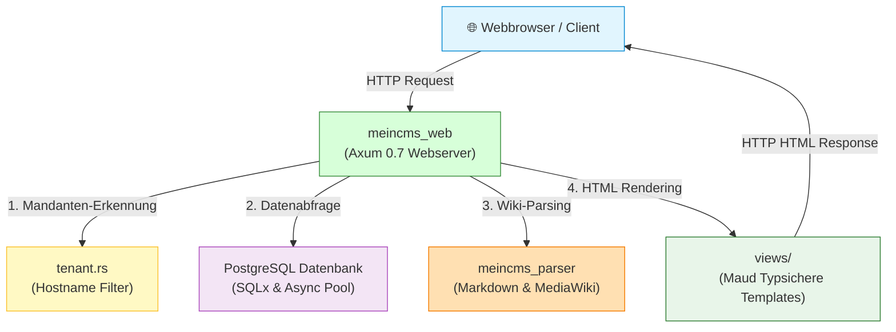
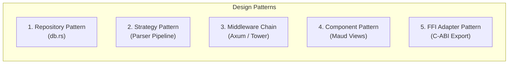
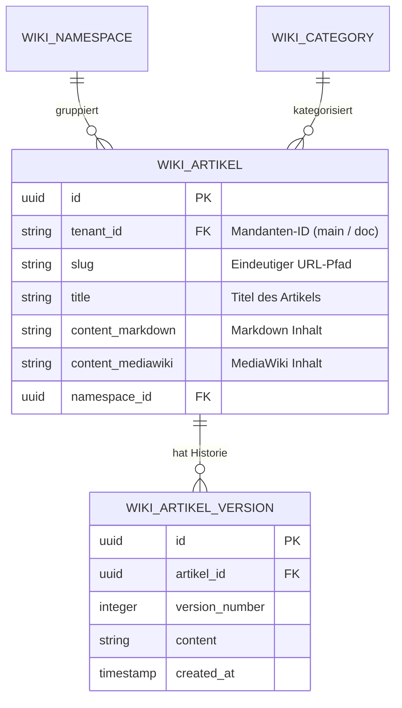

# 📐 System-Architektur, Bausteine & Design Patterns

Dieses Kapitel erklärt den gesamten Aufbau von **wissen-ahrensburg.de (MeinCMS)** so, dass ihn **jeder** – vom Entwickler über den Systemadministrator bis hin zu KI-Agenten – schnell und mühelos verstehen kann.

---

## 1. Übersicht: Was ist MeinCMS?

**MeinCMS** ist ein modernes, hochperformantes Wiki- und Content-Management-System (CMS) mit **Multi-Tenancy** (Mandantenfähigkeit), das vollständig in **Rust** entwickelt wurde und **PostgreSQL** als Datenbank nutzt.



### Die wichtigsten Eigenschaften auf einen Blick:
1. **100% Speichersicher & Schnell:** Entworfen als Rust-Workspace ohne schwerfällige Runtimes.
2. **Multi-Tenancy (Mandantenfähigkeit):** Ein einziger Server kann mehrere unabhängige Wikis betreiben (z. B. Haupt-Wiki vs. Technik-Dokumentation), getrennt nach Mandanten-IDs (`tenant_id`).
3. **Zwei Wiki-Syntaxen:** Unterstützt klassisches **Markdown** und **MediaWiki-Wikitext**.
4. **Keine Inline-Skripte / XSS-Schutz:** Höchste Sicherheit durch automatisches HTML-Escaping in Maud und No-Cache-Middleware.

---

## 2. Die 4 Kernbausteine (Rust Crates)

Das Projekt ist in **4 spezialisierte Pakete (Crates)** unterteilt, die zusammen den Rust Workspace bilden:

```mermaid
graph TD
    subgraph Rust Workspace (Cargo.toml)
        WEB["meincms_web\n(Axum Webanwendung & Maud UI)"]
        PARSER["meincms_parser\n(Markdown, MediaWiki & C-FFI Export)"]
        BACKUP["meincms_backup\n(CLI: Export, Import & Repair)"]
        ADMIN["meincms_admin\n(CLI: User- & Passwort-Verwaltung)"]
    end

    WEB -->|Nutzt als Dependency| PARSER
    BACKUP -->|Nutzt als Dependency| PARSER
```

| Crate | Aufgabe & Zweck | Wichtige Dateien |
| :--- | :--- | :--- |
| **`meincms_web`** | Das zentrale Web-Backend. Verwaltet HTTP-Routen, Authentifizierung, Mandanten und Rendern der Benutzeroberfläche. | `main.rs`, `handlers.rs`, `db.rs`, `tenant.rs`, `views/` |
| **`meincms_parser`** | Die Parsing-Engine. Wandelt Markdown und MediaWiki-Syntax in sicheres HTML um. Exportiert auch eine C-Bibliothek (`meincms_parser.h`) und Rhai-Skripte. | `markdown.rs`, `wikitext.rs`, `scripting.rs`, `ffi.rs` |
| **`meincms_backup`** | Ein eigenständiges CLI-Werkzeug für Datensicherungen (YAML/XML), Datenwiederherstellung und Reparatur von Wiki-Artikeln. | `main.rs` |
| **`meincms_admin`** | Ein CLI-Werkzeug für Administratoren zur Benutzerverwaltung und zum sicheren Hashen von Passwörtern mit Argon2id. | `main.rs` |

---

## 3. Datenfluss: Wie verarbeitet das System eine Anfrage?

Wenn ein Benutzer eine Wiki-Seite aufruft (z. B. `https://wissen-ahrensburg.de/wiki/Hauptseite`), passiert Folgendes:

1. **Routing & Middleware (`meincms_web`):**
   Der **Axum Webserver** nimmt den HTTP-Request entgegen. Die **Tenant-Middleware** liest den Hostnamen aus und bestimmt den aktuellen Mandanten (`main` oder `doc`).
2. **Datenbankabfrage (`db.rs`):**
   Über **SQLx** wird der gewünschte Artikel für diesen Mandanten aus der PostgreSQL-Datenbank geladen.
3. **Text-Transformation (`meincms_parser`):**
   Der gespeicherte Rohtext (Markdown oder MediaWiki) wird an `meincms_parser` übergeben und blitzsicher in HTML konvertiert.
4. **HTML-Generierung (`views/`):**
   **Maud** (ein typsicheres Rust-Makro) baut das vollständige HTML-Dokument zusammen (Navigation, Artikelinhalt, Footer).
5. **Antwort senden:**
   Der Server sendet das fertige HTML mit **No-Cache-Sicherheitsheadern** an den Browser zurück.

---

## 4. Software-Entwurfsmuster (Design Patterns) im Projekt

Um den Code sauber, wartbar und erweiterbar zu halten, werden bewährte Entwurfsmuster eingesetzt:



### 🗄️ 1. Repository Pattern (Datenzugriffsschicht in `db.rs`)
* **Konzept:** Die Webanwendung greift nicht direkt mit rohen SQL-Strings in Handlern auf die Datenbank zu, sondern nutzt Datenzugriffsfunktionen in `db.rs`.
* **Vorteil:** SQL-Abfragen sind zentral gebündelt. Bei Datenbankänderungen muss nur `db.rs` angepasst werden.

### 🔄 2. Strategy Pattern (Parser-Auswahl in `meincms_parser`)
* **Konzept:** Artikel können in Markdown oder MediaWiki-Syntax vorliegen. Das System wählt je nach Artikeltyp dynamisch die passende Parser-Strategie (`markdown::render` oder `wikitext::render`).
* **Vorteil:** Neue Formate (z. B. Org-Mode oder AsciiDoc) können als neue Strategie hinzugefügt werden, ohne die Webanwendung zu verändern.

### ⛓️ 3. Middleware Chain Pattern (Axum / Tower Services in `tenant.rs` & `auth.rs`)
* **Konzept:** Jede Anfrage durchläuft eine Kette von Filtern:
  1. *Multi-Tenancy Filter:* Welcher Mandant ruft auf?
  2. *Authentication Filter:* Ist der Admin eingeloggt?
  3. *Security Header Filter:* Werden `No-Cache` und `X-Content-Type-Options` erzwungen?
* **Vorteil:** Klare Trennung von Sicherheits- und Geschäftslogik (Separation of Concerns).

### 🧩 4. Component-Based UI Pattern (Maud Templates in `views/`)
* **Konzept:** Statt schwerfälliger Template-Dateien (wie Jinja2 oder HTML-Dateien) wird die Benutzeroberfläche in kleinen, wiederverwendbaren Rust-Funktionen aufgebaut.
* **Vorteil:** Kompilierzeit-Prüfung aller HTML-Strukturen, kein Tippfehler bei Variablen und automatisches XSS-Escaping.

### 🔌 5. FFI Adapter Pattern (C-ABI Hülle in `ffi.rs`)
* **Konzept:** Der Rust-Parser stellt über C-kompatible Funktionsaufrufe (`extern "C"`) und eine Header-Datei (`meincms_parser.h`) eine Schnittstelle für externe Sprachen (C, C++, Node.js, Python) bereit.
* **Vorteil:** Das Parser-Crate kann außerhalb des Rust-Ökosystems als native Shared Library (`.so` / `.dll`) wiederverwendet werden.

---

## 5. Datenbank-Schema & Datenmodell (PostgreSQL)

Die Datenbank verwendet ein klares, relationales Schema mit strikter Mandantentrennung:



* **Mandantentrennung:** Alle Tabellen filtern standardmäßig über `tenant_id`. Datensätze verschiedener Mandanten können sich niemals vermischen.
* **Historisierung:** Bei jeder Artikeländerung wird eine neue `WIKI_ARTIKEL_VERSION` angelegt, wodurch Änderungen rückgängig gemacht werden können.

---

## 💡 Zusammenfassung für Entwickler & KI-Agenten

1. **Wo erstelle ich neue Funktionen?**
   * Neue HTTP-Endpunkte -> `meincms_web/src/handlers.rs`
   * Neue UI-Komponenten -> `meincms_web/src/views/`
   * Datenbank-Abfragen -> `meincms_web/src/db.rs`
   * Parser-Erweiterungen -> `meincms_parser/src/`
2. **Wie teste und baue ich das Projekt?**
   * Prüfen: `cargo check` & `cargo test --workspace`
   * Linter: `cargo clippy`
   * Doku bauen: `npm run build:docs`
